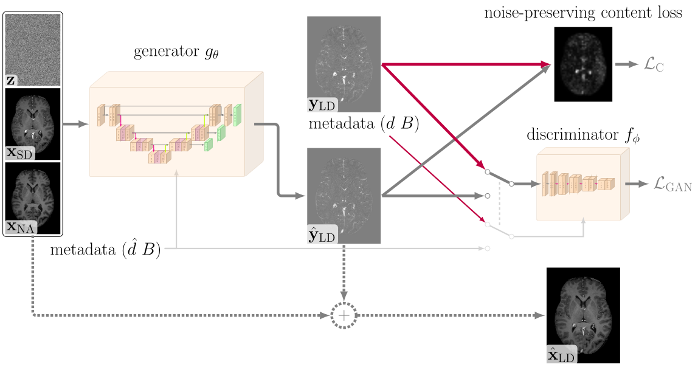
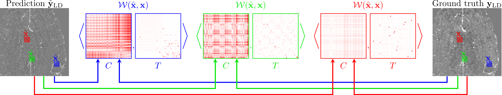

# Faithful Synthesis of Low-dose Contrast-enhanced Brain MRI Scans using Noise-preserving Conditional GANs

Source code for the paper "Faithful Synthesis of Low-dose Contrast-enhanced Brain MRI Scans using Noise-preserving Conditional GANs".

[Thomas Pinetz](https://scholar.google.com/citations?user=hz1y3_0AAAAJ&hl=en/), 
[Erich Kobler](https://scholar.google.com/citations?user=1Tb3vdEAAAAJ&hl=en&oi=ao), 
[Robert Haase](https://scholar.google.com/citations?user=YJvg0NYAAAAJ&hl=en&oi=ao), 
[Katerina Deike-Hofmann](https://scholar.google.com/citations?user=vb7kvqUAAAAJ&hl=en&oi=ao), 
[Alexander Radbruch](https://scholar.google.com/citations?user=lYfsUSkAAAAJ&hl=en&oi=ao), 
[Alexander Effland](https://scholar.google.com/citations?user=BDTa2QsAAAAJ&hl=en&oi=ao)

## Overview

* Teaser Figure

   

* Noise-preserving content loss

   
    

## Requirements

We provide a `environment.yaml` file to automatically build the environment.

To actually run the scripts the location of the execution should be inside the src folder. 

## How-To

For the generation of new low-dose images run for dose_level $20\%$:

```
python inference_brats.py --ds 0.2
```

To run the standard dose prediction run:

```
python brats_standard_dose_inference.py 
```

For this script we expect the scans to already have been subject to pre-processing (e.g. spatial and radiometric registration), which is the case for the prediction produced by the `inference_brats.py` script.

We included the checkpoint used in the paper to generate the low-dose images and a checkpoint for $10\%$, $20\%$ and $30\%$ trained on real low-dose data to test the resulting low-dose images.

The proposed loss criterion is the function PatchWiseWasserSteinSinkhorn defined in `loss_criterions.py`.
We used the pytorch lightning framework to train our model and the base model is given in gan_models.
Network architectures are defined in networks_cond.py and discriminator.py and definition of hyperparameters are given in the respective config files.


## Dataset

We use the BraTS dataset to produce our results. 

If you use the same dataset you should cite the respective paper as is descriped here: https://www.med.upenn.edu/cbica/brats2020/data.html


## Bibtex (Preprint)


```BibTex
@article{pinetz2023faithful,
title={Faithful Synthesis of Low-dose Contrast-enhanced Brain MRI Scans using Noise-preserving Conditional GANs}, 
author={Pinetz, Thomas and Kobler, Erich and Haase, Robert and Deike-Hofmann, Katerina and Radbruch, Alexander and Effland, Alexander},
year={2023},
journal={arXiv preprint arXiv:2306.14678}
}